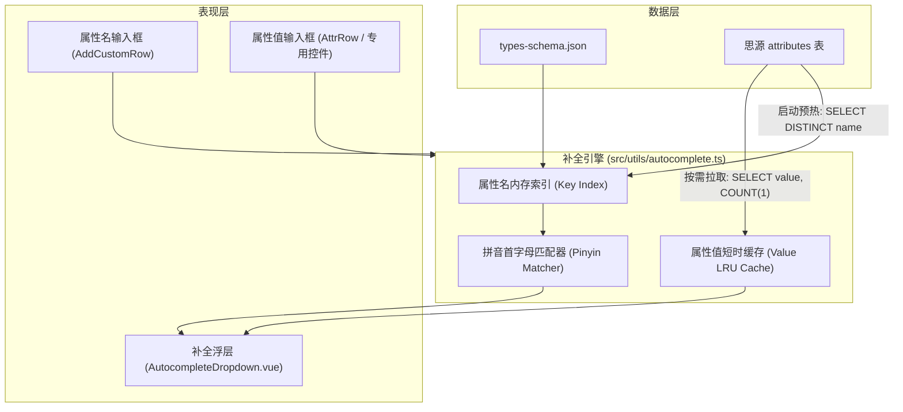
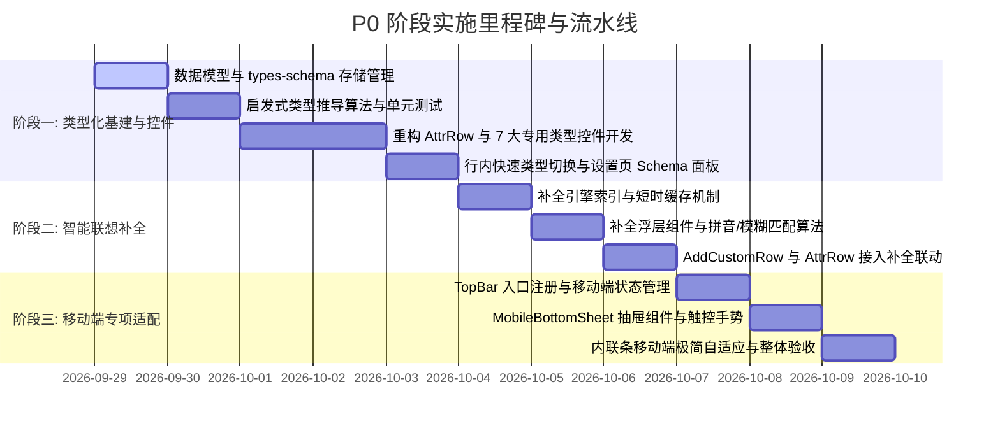

# P0 阶段：类型化基建与交互补齐（体验筑基）详细技术方案与实施计划

> **文档状态**：已评审并对齐（正式执行）  
> **文档版本**：v1.0  
> **关联依据**：[竞品调研与产品竞争力分析报告](file:///D:/MyCodingProjects/siyuan-property-manager/docs/%E7%AB%9E%E5%93%81%E8%B0%83%E7%A0%94%E4%B8%8E%E4%BA%A7%E5%93%81%E7%AB%9E%E4%BA%89%E5%8A%9B%E5%88%86%E6%9E%90%E6%8A%A5%E5%91%8A.md)  
> **目标工程**：思源笔记插件 · 属性管家 (`siyuan-property-manager`)

---

## 1. 背景与建设目标

在《竞品调研与产品竞争力分析报告》中，属性管家凭借思源底层“一切皆块”的优势，在块级属性实时感知、SQL 全局运维与一键生成属性视图（AV）上奠定了差异化壁垒。然而，当前版本在日常录入体验中存在三个核心痛点：
1. **全文本录入**：所有自定义属性降水为纯字符串，缺乏单选（Select）、多选（Multi-Select）、日期（Date）、数字（Number）、开关（Checkbox）和块引用（Block-Ref）等结构化类型，用户操作摩擦力大。
2. **无智能补全**：新增属性需手工键入完整键名，属性值需手工输入全部字符，容易产生拼写不一致。
3. **移动端体验受限**：思源移动端（iOS / Android / 平板）没有常驻右侧 Dock，在移动端查看和修改块属性流程冗长。

**P0 阶段的核心目标**：彻底告别纯文本散装录入时代，构建以 **全局 Schema 注册表 + 智能推导** 为基础的结构化类型系统，引入 **即时联想补全引擎**，并补齐 **移动端专属底部抽屉（Bottom Sheet）** 交互，使属性管家的录入体验达到行业一流水平。

---

## 2. 核心架构设计与决策矩阵

经过架构评审（Grill-me 决议），本阶段技术决策如下：

| 架构分支 | 选定方案 | 决策依据 |
| :--- | :--- | :--- |
| **P0 交付策略** | 完整包含三大模块，方案统一归档，实施时按模块流水线推进 | 保证系统完整性与模块依赖平滑递进，各阶段构建测试持续绿灯 |
| **类型定义与持久化** | **全局 Schema 注册表 (`types-schema.json`) + 智能启发式推导** | 全局统一属性类型标准（对标 Obsidian Properties），向下兼容无配置的老数据 |
| **复杂类型存储序列化** | 多选采用**逗号分隔字符串**（`Tag1, Tag2`），块关联存储**纯净 22 位块 ID** | 保证思源原生属性面板人类可读性最高，块引用无锚文本失效风险 |
| **补全引擎抓取与交互** | **内存常驻缓存 + 异步 Top 50 频次值查询 + 键盘无感联动** | 属性名 0 延迟补全，属性值防抖查询无数据库压力，支持拼音首字母匹配 |
| **移动端交互形态** | **TopBar 顶栏图标 + 内联条紧凑徽标唤起 Bottom Sheet 抽屉** | 不遮挡正文写作，符合移动端触控标准（≥44px），手势滑动平滑收起 |
| **Schema 管理入口** | **行内快速切换（类型图标 Popover） + 设置页集中管理面板** | 满足随写随改的高频诉求，同时提供全库 Schema 资产全景治理能力 |

---

## 3. 详细技术方案

### 3.1 模块一：属性类型系统（Type System）与 Schema 注册表

#### 3.1.1 类型定义与数据契约

在 `src/types/schema.d.ts` 与 `src/constants/schema.ts` 中定义核心数据类型：

```typescript
export type AttrType =
  | 'text'          // 单行/多行文本
  | 'number'        // 数字类型
  | 'select'        // 单选枚举
  | 'multi-select'  // 多选标签
  | 'date'          // 日期/时间
  | 'checkbox'      // 布尔开关
  | 'block-ref'     // 块引用关联

export interface AttrOption {
  id: string
  label: string
  value: string
  color?: string    // 预设或自定义标签色
}

export interface AttrSchemaItem {
  name: string      // 完整属性名，例如 "custom-status"
  type: AttrType
  label?: string    // 友好显示名称
  options?: AttrOption[] // select / multi-select 的候选选项
  dateFormat?: string    // YYYY-MM-DD
  numberFormat?: 'number' | 'currency' | 'percent'
}

export interface TypesSchemaStorage {
  version: number
  schemas: Record<string, AttrSchemaItem> // key 为 custom-* 属性名
}
```

#### 3.1.2 预置颜色池规范
为单选与多选 Tag 提供思源主题自适应的柔和色彩体系（支持明暗模式）：
- 蓝（`#3b82f6` / `#1d4ed8`）
- 绿（`#10b981` / `#047857`）
- 橙（`#f97316` / `#c2410c`）
- 紫（`#8b5cf6` / `#6d28d9`）
- 红（`#ef4444` / `#b91c1c`）
- 灰（`#6b7280` / `#4b5563`）
- 黄（`#eab308` / `#a16207`）
- 青（`#06b6d4` / `#0e7490`）

#### 3.1.3 启发式类型推导（Type Inference）算法
当某自定义属性未在 `types-schema.json` 中配置时，由推导器 `inferAttrType(key, value)` 自动推导类型：
1. 若 `value === 'true' || value === 'false'`，推导为 `checkbox`；
2. 若匹配 ISO 日期格式（如 `^\d{4}-\d{2}-\d{2}( \d{2}:\d{2}(:\d{2})?)?$`），推导为 `date`；
3. 若匹配纯有效数值（如 `/^-?\d+(\.\d+)?$/`），推导为 `number`；
4. 若匹配 22 位思源块 ID 格式（`^\d{14}-[a-z0-9]{7}$`），推导为 `block-ref`；
5. 若包含英文或中文逗号分隔符（`[,，]`），推导为 `multi-select`；
6. 其余情况默认兜底为 `text`。

#### 3.1.4 专用类型编辑器组件体系
将单一的文本输入重构为基于组件分发的高内聚控件族：
- `src/components/types/AttrTypeText.vue`：单行/多行文本编辑，保留现有 Esc/Enter/Blur 提交与自动换行展开。
- `src/components/types/AttrTypeNumber.vue`：纯数字输入校验、步进按钮、支持货币/百分比格式化展示。
- `src/components/types/AttrTypeSelect.vue`：彩色药丸（Pill）标签展示，点击呼出轻量下拉选单，支持键盘上下键选择、即时新增 Option。
- `src/components/types/AttrTypeMultiSelect.vue`：多 Tag 胶囊列表，支持点击 `✕` 移除标签、下拉面板多选、回车快速创建新标签。
- `src/components/types/AttrTypeDate.vue`：日期格式化展示，点击弹出日期选择浮层，提供“今天”、“明天”、“昨天”、“清除”快速按钮。
- `src/components/types/AttrTypeCheckbox.vue`：布尔开关 Toggle 开关，一键切换 `true`/`false`，支持键盘空格键触发。
- `src/components/types/AttrTypeBlockRef.vue`：渲染块标题/摘要预览徽章与跳转图标；编辑时弹出块搜索框，调用 `/api/search/searchBlock` 模糊检索并回填块 ID。

#### 3.1.5 行内类型切换与设置页管理
- **行内切换**：在 `AttrRow.vue` 属性名左侧增加类型小图标，点击展开类型菜单（Type Menu），切换类型时自动更新并保存 `types-schema.json`。
- **设置页集中管理**：在 `Setting` 弹窗中提供“全局属性类型管理”标签页或面板，支持列出全库已有 Schema、批量修改类型、自定义选项与颜色池。

---

### 3.2 模块二：智能联想与自动补全引擎（Autocomplete Engine）

#### 3.2.1 架构分层设计



#### 3.2.2 属性名补全（Key Autocomplete）
1. 插件启动时，通过 SQL：`SELECT DISTINCT name FROM attributes WHERE name LIKE 'custom-%'` 检索全量历史属性名。
2. 将结果与 `types-schema.json` 中的所有键合并去重，放入内存响应式集合。
3. 用户在 `AddCustomRow` 输入时（如键入 `sta` 或拼音首字母 `zt`），毫秒级滤出匹配项，展示下拉建议。
4. 用户回车或 Tab 选中后，自动填充键名，光标自动跃迁聚焦至值输入控件。

#### 3.2.3 属性值推荐（Value Suggestion）
1. 当聚焦于某个具体属性的值输入框时，优先提取该属性在 Schema 中配置的 `options`。
2. 若为非枚举型或允许自由输入，引擎异步防抖向 SQLite 发起 Top 50 高频值查询：
   ```sql
   SELECT value, COUNT(1) AS cnt FROM attributes
   WHERE name = ? AND value != ''
   GROUP BY value ORDER BY cnt DESC LIMIT 50
   ```
3. 查询结果以 `name` 为 key 存入短时缓存（5 分钟内有效）。
4. 输入字符时根据前缀与包含关系快速筛选，提供联想列表。

#### 3.2.4 键盘导航标准
- `ArrowDown` / `ArrowUp`：上下切换高亮候选条目；
- `Enter` / `Tab`：选中高亮项并关闭浮层；
- `Escape`：关闭补全浮层并保留当前手动输入的原始文本；
- 外部点击（Click Outside）：自动失焦并关闭浮层。

---

### 3.3 模块三：移动端专项适配（Mobile First Adaptation）

#### 3.3.1 移动端检测与入口注册
在 `src/index.ts` 中检测到移动端环境（`this.isMobile === true`）时：
1. **顶栏图标注册**：
   ```typescript
   this.addTopBar({
     icon: 'iconPropertyManager',
     title: this.i18n.dockTitle,
     position: 'right',
     callback: () => {
       this.toggleMobileSheet()
     }
   })
   ```
2. **内联条移动端自适应**：
   在移动端狭窄视口下，`DocInlineAttrs.vue` 默认收缩为单行极简药丸徽标（如 `📌 3 属性 · 点击查看`），轻触直接唤起 Bottom Sheet。

#### 3.3.2 移动端底部抽屉（Mobile Bottom Sheet）
新增组件 `src/components/mobile/MobileBottomSheet.vue`：
1. **DOM 挂载策略**：通过 Vue `Teleport` 挂载到 `document.body` 顶层，避开编辑器容器内部样式溢出与裁剪。
2. **交互细节**：
   - 顶部提供居中手势滑动条（Drag Handle）；
   - 支持向下轻扫手势直接收起；
   - 底部与侧边提供半透明暗色遮罩层，点击遮罩平滑收起；
   - 内部复用 `PropertyPanel.vue`，但在移动端自适应放大触控尺寸（输入框高度 ≥ 40px，按钮触控目标 ≥ 44px）；
   - 监听思源虚拟键盘事件（`mobile-keyboard-show` / `mobile-keyboard-hide`），自动调整抽屉最大高度并启用内部顺畅滚动，避免键盘遮挡当前编辑行。

---

## 4. 实施阶段计划与里程碑 (Roadmap)

本工程分 **3 个冲刺阶段** 递进落地，保证每个阶段均可独立编译、运行且测试全绿：



### 阶段一：类型化基建与编辑器控件重构
- [ ] 创建 `src/types/schema.d.ts`，定义 `AttrType`、`AttrSchemaItem`、`TypesSchemaStorage`
- [ ] 创建 `src/composables/useAttrSchema.ts`，支持 Schema 读写持久化、单例响应式与事件同步
- [ ] 编写类型推导工具 `src/utils/typeInference.ts` 与对应单元测试 `tests/typeInference.test.ts`
- [ ] 开发专用类型控件：
  - [ ] `AttrTypeText.vue`
  - [ ] `AttrTypeNumber.vue`
  - [ ] `AttrTypeSelect.vue`
  - [ ] `AttrTypeMultiSelect.vue`
  - [ ] `AttrTypeDate.vue`
  - [ ] `AttrTypeCheckbox.vue`
  - [ ] `AttrTypeBlockRef.vue`
- [ ] 重构 `AttrRow.vue` 为分发器，集成类型切换 Popover
- [ ] 更新 `zh_CN.json` 与 `en_US.json` 国际化文案
- [ ] 完善 `src/settings.ts`，提供集中式全局 Schema 管理列表
- [ ] 验证：`npm test` 与 `npm run build` 通过

### 阶段二：智能联想与自动补全引擎
- [ ] 开发补全核心算法 `src/utils/autocomplete.ts`（包含 Trie / 倒排索引、拼音首字母匹配、Top 50 频次缓存）
- [ ] 开发单元测试 `tests/autocomplete.test.ts`
- [ ] 开发通用的补全浮层组件 `src/components/AutocompleteDropdown.vue`，实现无感键盘导航（↑↓、Enter、Tab、Esc）
- [ ] 在 `AddCustomRow.vue` 中集成属性名历史补全与属性值联想
- [ ] 在通用行控件中集成高频历史值快捷挑选
- [ ] 验证：`npm test` 与 `npm run build` 通过

### 阶段三：移动端专项抽屉与触控优化
- [ ] 在 `src/index.ts` 中注册移动端顶栏图标（`addTopBar`）
- [ ] 开发 `src/components/mobile/MobileBottomSheet.vue`，实现遮罩、拖拽条、滑动收起手势
- [ ] 在 `DocInlineAttrs.vue` 中针对移动端提供紧凑徽标形态
- [ ] 针对移动端适配触控尺寸、外边距与键盘避让样式（`src/index.scss`）
- [ ] 验证：全量测试回归与生产构建验证

---

## 5. 质量保证与交付验收标准

1. **测试覆盖率**：原有 78 项单元测试继续 100% 通过，新增 Schema 存取、类型推导、补全匹配算法的测试用例，全套测试绿灯。
2. **规范守则**：
   - 遵循用户规则与项目规范：Vue SFC `<template>` 在 `<script setup>` 之前，2 空格缩进，单引号，无分号，`spm-` 类名；
   - 样式统一维护在 `src/index.scss`；
   - 所有新增用户文案均同步提供 `zh_CN.json` 和 `en_US.json`。
3. **性能指标**：
   - 类型切换与推导耗时 ≤ 5ms；
   - 属性名与属性值自动补全响应耗时 ≤ 10ms，键入无任何顿挫感；
   - 移动端 Bottom Sheet 展开动画流畅无丢帧。
