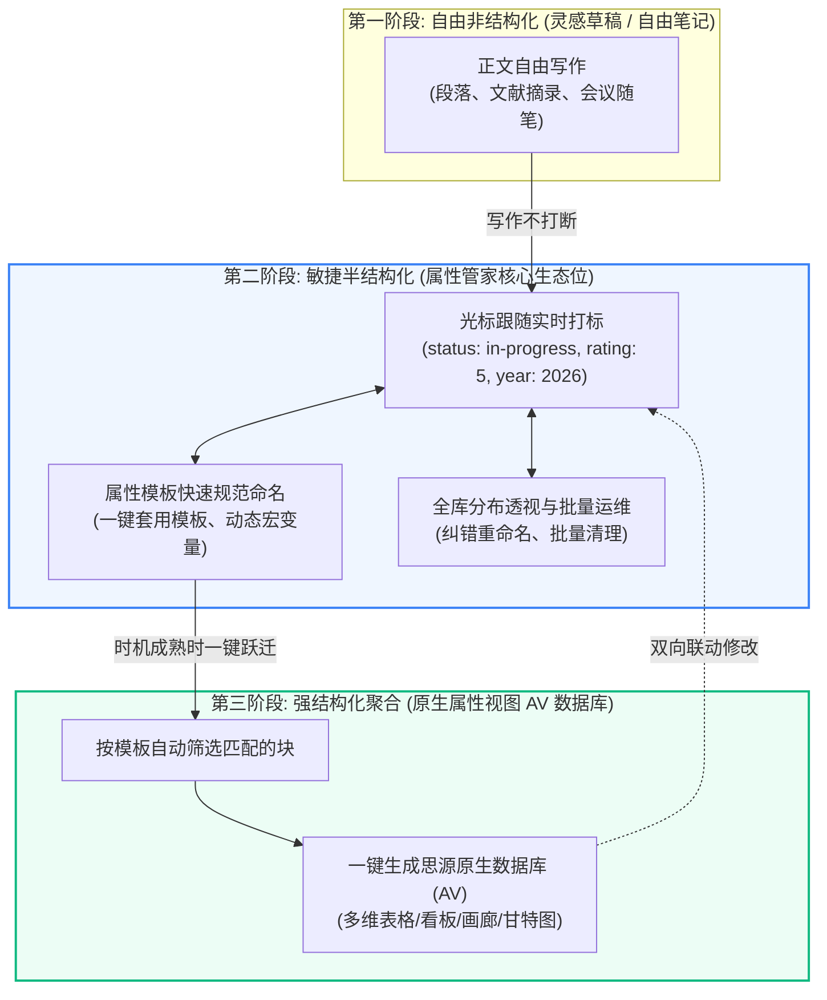

> 如果提供增强属性类型，那么跟用户直接使用思源笔记本体提供的属性视图（数据库）有什么区别，本插件的独特价值在哪里？

这是一个非常深刻、直击产品核心定位（Product Positioning）与价值主张（Value Proposition）的关键问题。

如果仅从“都支持单选、日期、数字等类型”的表面特性来看，两者看似重合；但从**底层数据模型、写作心智、知识演进生命周期以及全局治理能力**来看，两者有着本质的区别：

> **核心结论**：  
> **思源属性视图（AV 数据库）是数据的「终态展示与多维分析中心」（Destination: 强结构化看板/表格）**；  
> **属性管家插件是数据的「源头流式打标、敏捷治理与建库孵化器」（Origin: 伴随式打标、轻量语义、数据治理桥梁）**。  
> 两者绝非互相替代的竞争关系，而是**“数据生产流”**与**“数据消费流”**的上下游互补关系。

---

### 一、六大核心维度深度对比

| 比较维度 | 思源原生属性视图 (Attribute View / 数据库) | 属性管家插件 (增强属性类型) |
| :--- | :--- | :--- |
| **设计隐喻** | **多维表格 / 容器 (Container)** 类似 Airtable / Notion Database | **原子化标签与大纲字段 (Fluid Tagging)** 类似 Tana Supertag / Obsidian Properties |
| **写作心智负担** | **高摩擦力（预设型架构）** 用户必须“先建库、先设计列结构”，再把内容填进去，严重打断写作心流。 | **零摩擦力（伴随型沉浸打标）** 自由沉浸写作，光标点到任意段落/标题，随手选个状态、打个评分，不改变排版。 |
| **数据归属与生命周期** | **数据归属于特定数据库文件** 列数据存在 `/storage/av/<id>.json` 中。如果脱离或删除该数据库，块本身不再拥有这些数据。 | **数据与块生死相随（原生 IAL）** 属性直接写入块的底层 Kramdown IAL 和 SQLite。无论块移动、引用、嵌入何处，元数据永不丢失。 |
| **作用范围与纳管粒度** | **局部孤岛** 每张表只管自己内部绑定的行，多张表之间属性割裂，无法进行跨库全局统计。 | **全域穿透（全库任意块）** 全笔记本任意文档、任意段落都可以打标，并能全局跨文档进行聚合与多维透视。 |
| **知识沉淀阶段** | **重型强结构化阶段（后期阶段）** 适合项目看板、客户清单、固定资产库等规整表格场景。 | **敏捷半结构化阶段（源头孵化）** 适合文献精读、卡片盒笔记、大纲速记、自由任务等散点式记录。 |
| **元数据治理能力** | **无全局治理能力** 无法统计全库一共用了多少种属性值，无法一键批量重命名或清理过时属性。 | **强大的全库 SQL 批量治理引擎** 一键透视全库属性分布，支持多选批量重命名、批量删除、全局纠错。 |

---

### 二、知识演进的三个生命周期：插件不可替代的生态位

人类记录与思考知识的过程，天然遵循以下递进规律：

1. **思源本体的痛点——断层与门槛**：  
   用户在沉浸式写笔记（如读一本书、写一篇调研）时，不可能每写一个观点就去新建一个数据库表格。但如果不建表格，只用思源原生的块属性弹窗，就只能面对极其难用的纯文本 `<textarea>`，全靠手动敲入键盘，极易拼写错误，最终导致大量笔记**处于“无元数据”或“元数据混乱”的荒废状态**。
2. **属性管家的桥梁价值**：  
   它填补了从**“散乱笔记”**到**“正规数据库”**之间的巨大鸿沟。让用户在第二阶段（半结构化打标）享受到媲美数据库的强类型体验（单选胶囊、日期选择、数字校验），并在数据积累到一定规模时，**一键升格为思源原生数据库**。

---

### 三、本插件提供增强属性类型后的四大独特价值壁垒

#### 1. 块级伴随式打标的“极致输入效率”（比原生 AV 快 3~5 倍）
- **原生 AV 的操作路径**：  
  如果想用原生数据库管理属性，用户需要：  
  *找到数据库页面 -> 滚动定位到对应行 -> 横向滑到对应列 -> 点击单元格编辑*；  
  或者：*右键块 -> 点击块属性 -> 切换到“数据库”选项卡 -> 如果该块之前没加入数据库，则根本无法打标！*
- **属性管家的操作路径**：  
  侧边栏 Dock 随光标实时跟随。在正文中写到哪，右侧栏就是当前块的专属属性面板。  
  **单选直接点选标签，日期弹窗一点即填，失焦毫秒级自动保存**，输入体验如同原生 Markdown 一样自然，彻底保留写作心流。

#### 2. “真·数据属于块本身”（脱离数据库依旧自洽）
- 原生 AV 数据库中创建的列和值，本质上是保存在 `/data/storage/av/<avID>.json` 里的。如果某天用户把这篇文档导出为 Markdown、或者删除了这个数据库块，这些自定义属性**完全不保存在块上**，数据直接随数据库灰飞烟灭。
- 属性管家操作的属性，**直接写入块自身的 Kramdown IAL 中（`.sy` 核心数据）**。  
  这意味着：**无论这个块被移动到哪个文档、被复制、被块引用（Block Ref）、还是做嵌入块，属性始终紧紧贴在块身上**，真正做到了“一切皆块，块即实体”。

#### 3. 全局数据透视与敏捷重构（AV 数据库的“上帝视角管理工具”）
- 原生 AV 数据库是彼此孤立的“信息岛屿”：你在 A 数据库建了一个列叫 `优先级`，在 B 数据库建了一个列叫 `Priority`，思源原生无法提供全库聚合。
- 属性管家提供的是**全笔记本维度的全局数据治理引擎**：
  - 一眼看出全库有多少个块标记了 `status=待处理`，有多少个标记了 `status=进行中`；
  - 发现有 10 个块拼错了属性值（如 `P0` 写成了 `p0`），在统计列表中勾选，输入新值，**一键全库批量重命名替换**；
  - 这种跨越文档与数据库全局的“元数据清洗与治理能力”，是单一属性视图永远无法具备的。

#### 4. “从属性到数据库”的孵化闭环（向原生 AV 输送养料）
- 增强属性类型不仅不排斥原生 AV，反而是**原生 AV 的最佳数据来源与孵化器**。
- 典型工作流：
  1. 用户在日常随笔中套用 `#文献笔记` 属性模板（包含 `status: select`、`rating: number`、`year: date`）；
  2. 一个月后积累了 80 个文献块；
  3. 用户点击属性管家的“按模板聚合建库”，插件**自动创建原生 AV 数据库、自动创建对应的类型列、自动将这 80 个块作为行导入并回填数据**；
  4. 后续结合双向联动，用户既可以在表格中全局盘点，也可以在正文中随时单块修改。

---

### 总结：一句话定位

- **思源原生属性视图（AV）** 解决的是 **“如何将多条数据像 Excel / Airtable 一样集中展示、筛选、排序与看板化”**；
- **属性管家插件** 解决的是 **“如何在日常不写表格的自由正文写作中，以极低的成本、极规范的格式打上元数据，并进行全库治理与无缝升格建库”**。

增强属性类型并不是要在侧栏“重新做一个缩略版数据库”，而是要让**每一个普通的文字块、标题块、卡片块，都能拥有媲美现代面向对象笔记（如 Tana Supertag / Capacities）的结构化语义表达能力**。