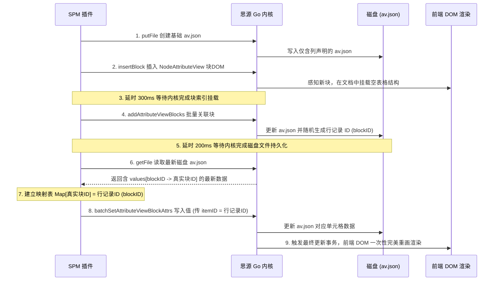

# 思源笔记属性视图 (Attribute View / 数据库) 开发指南

本指南总结了思源笔记属性视图（又称数据库，Attribute View / AV）的核心数据结构、相关 API 接口要点、原生自定义属性绑定机制，以及在批量导入或创建数据库时的核心开发流程与避坑指南。

---

## 1. 背景与概念简述

思源笔记在后续版本（目前 spec 协议主要为 v4）中引入了原生的**属性视图（Attribute View）**，即数据库功能。
*   **块属性（Block Attributes）**：每个内容块在底层 SQLite 的 `attributes` 表（或内联属性 IAL）中可以通过 `custom-` 前缀声明自定义键值对。
*   **属性视图（Attribute View）**：以表格（Table）、看板（Board）等形式展示结构化数据的数据库组件。
*   **双向关联**：通过特殊命名的数据库列，可以直接在数据库表格中回显和修改内容块本身的自定义属性。

---

## 2. 属性视图数据架构 (AV JSON 规范)

属性视图的配置文件以 JSON 格式存储在思源工作空间的 `/data/storage/av/{avID}.json` 路径下。

### 核心 JSON 字段说明

| 字段名 | 类型 | 含义 |
| :--- | :--- | :--- |
| `spec` | `number` | 配置版本（通常为 `4`） |
| `id` | `string` | 属性视图唯一标识符（`avID`） |
| `keyValues` | `Array` | 列定义（`key`）与该列所有格子具体值（`values`）的组合数组 |
| `keyIDs` | `Array` | 记录字段顺序的 `key.id` 列表 |
| `views` | `Array` | 不同的视图配置（表格/看板等视图类型的列宽、排序、过滤条件） |

### `keyValues` 中的关联列结构

在创建列（即 `key` 定义）时：
*   **`key.id`**：列的唯一 ID。
*   **`key.name`**：列的物理字段键名。如果它与内容块的原生自定义属性关联，**其值必须包含 `custom-` 前缀**（如 `custom-project`）。
*   **`key.type`**：数据类型（如 `text`、`number`、`select`、`mSelect`、`block` 等）。其中类型为 `block` 的列代表数据库的**主键（关联的内容块）**。

#### 示例：列描述与单元格数据结构
```json
{
  "keyValues": [
    {
      "key": {
        "id": "20260614145024-k6unz3p",
        "name": "主键",
        "type": "block",
        "icon": "",
        "desc": ""
      },
      "values": [
        {
          "id": "20260614145024-w1m4d05",
          "keyID": "20260614145024-k6unz3p",
          "blockID": "20260614145024-637d1be",  // 数据库内部随机分配的虚拟“行记录 ID”
          "type": "block",
          "block": {
            "id": "20260517132938-x9t3eq7",    // 真正的笔记内容块 ID
            "content": "内容片段..."
          }
        }
      ]
    },
    {
      "key": {
        "id": "20260614145024-t2yuivi",
        "name": "custom-project",
        "type": "text"
      },
      "values": [
        {
          "id": "20260614145025-jxgock3",
          "keyID": "20260614145024-t2yuivi",
          "blockID": "20260614145024-637d1be", // 必须对应上面的“行记录 ID”，前端才能正常渲染该行的此列值
          "type": "text",
          "text": {
            "content": "官网改版"
          }
        }
      ]
    }
  ]
}
```

> [!IMPORTANT]
> **行记录 ID (`blockID` 亦称 `itemID`) 与真实块 ID (`block.id`) 的区别**：
> 思源笔记在将块绑定到属性视图后，系统会为这行虚拟记录生成一个随机的行 ID（即主键的 `blockID`）。
> 在向该行的其它列（如自定义属性列）设置值时，必须使用**该行记录 ID** 作为操作的 `itemID`。若错误传入“真实的块 ID”，思源在底层的 JSON 中确实会将其存入单元格的 `blockID` 字段下，但在前端渲染时会因为与 `views[0].itemIds` 中的行记录 ID 不一致而无法回显，格子里仍会显示为空白。

---

## 3. 主要 API 接口要点

插件与思源内核进行数据库交互，可直接调用以下核心 API：

### 1) 写入 AV 配置文件
*   **API 路径**：`/api/file/putFile`
*   **用途**：以 `multipart/form-data` 的形式向 `/data/storage/av/{avID}.json` 路径上传一份最基本的结构 JSON 文件以声明该数据库的存在。
*   **基本 JSON 包含**：包含主键列 `type: 'block'`，和各个属性列 `type: 'text'` 的定义即可（行记录列表 `rowIds` / `itemIds` 可以先初始为 `null` 或空）。

### 2) 在文档中插入数据库块
*   **API 路径**：`/api/block/insertBlock`
*   **参数示例**：
    ```json
    {
      "dataType": "dom",
      "data": "<div data-type=\"NodeAttributeView\" data-av-id=\"{avID}\" data-av-type=\"table\"></div>",
      "parentID": "parent-block-id"
    }
    ```
*   **要点**：必须先执行此插入或挂载动作，让内核在当前打开的文档树中索引到该 `avID`。如果不插入就调用后续的绑定 API，内核可能会因为无活跃关联而拒绝操作。

### 3) 批量绑定内容块
*   **API 路径**：`/api/av/addAttributeViewBlocks`
*   **请求参数**：
    ```json
    {
      "avID": "20260614145024-gu5ihod",
      "srcs": [
        { "id": "真实的块 ID-1", "isDetached": false },
        { "id": "真实的块 ID-2", "isDetached": false }
      ]
    }
    ```
*   **功能**：内核会将这些内容块绑定至当前数据库，并在底层的 `av.json` 主键列中为每一项生成随机的行记录 ID，同时将行 ID 填充至 `views[0].itemIds`。

### 4) 批量回填格子的属性值
*   **API 路径**：`/api/av/batchSetAttributeViewBlockAttrs`
*   **请求参数**：
    ```json
    {
      "avID": "20260614145024-gu5ihod",
      "values": [
        {
          "keyID": "列唯一ID (20260614145024-t2yuivi)",
          "itemID": "行记录ID (20260614145024-637d1be)",
          "value": {
            "text": { "content": "官网改版" }
          }
        }
      ]
    }
    ```
*   **注意**：这里的 `itemID` **必须是思源分配的唯一行记录 ID**。

---

## 4. 创建并填充数据库的最佳开发时序

为避免频繁触发 DOM 并发绘制引发的前端 JavaScript 报错（如 `Cannot read properties of null (reading 'innerHTML')`），并确保数据能被百分之百准确写入持久化文件，必须严格按照以下开发时序操作：

### 🛠️ 最佳时序图 (Mermaid)



---

## 5. 常见已知限制与防坑指南

*   **列名称同步规则**：如果数据库列的值希望与块本身的属性值双向连通，建列的物理键名（`key.name`）必须为 `custom-` 开头的键（例如 `custom-project`）。若列名是不带前缀的 `project`，系统会将其视为仅存于数据库内部的 Detached 独立列。
*   **防竞态渲染崩溃**：绑定块和回填属性值是两次独立的写事务。不要略过延时或者直接在插入 DOM 前回填。在 `addAttributeViewBlocks` 后一定要加入 `200ms` 的延时来保证思源内核将随机分配的行 ID 写入磁盘，否则调用 `getFile` 读取到的 JSON 数据依然是绑定前的旧数据。
*   **降级容错**：在构建映射表时，务必加上 fallback 逻辑。若通过真实块 ID 在最新的 JSON 文件中找不到映射的行记录 ID，可降级回退使用真实块 ID，以保证即使接口产生瞬时异常，回填流程也能继续执行，不至于造成整个事务抛错阻塞。
