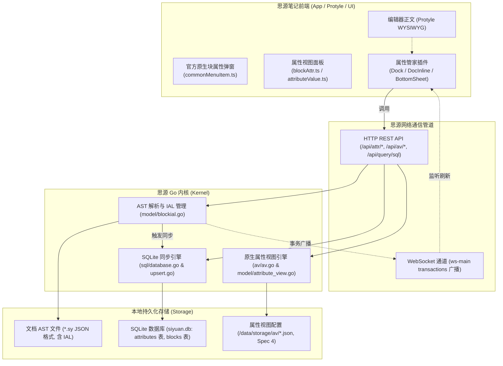

# 思源笔记本体底层支撑能力深度分析报告

> **文档状态**：正式归档  
> **报告版本**：v1.0  
> **源码分析基线**：`D:\MyCodingProjects\siyuan-note`（含 Go 后端内核与前端 TypeScript/Protyle）  
> **关联规划文档**：[`docs/competitor_analysis_and_product_roadmap.md`](file:///d:/MyCodingProjects/siyuan-property-manager/docs/competitor_analysis_and_product_roadmap.md)  

---

## 目录

1. [背景与分析目的](#1-背景与分析目的)
2. [思源笔记本体属性与数据架构全景](#2-思源笔记本体属性与数据架构全景)
3. [逐项规划特性的源码级支撑分析](#3-逐项规划特性的源码级支撑分析)
   - 3.1 [结构化属性类型系统 (Select / Date / Number / Checkbox / BlockRef)](#31-结构化属性类型系统-select--date--number--checkbox--blockref)
   - 3.2 [智能补全与联想机制 (Autocomplete Engine)](#32-智能补全与联想机制-autocomplete-engine)
   - 3.3 [移动端专属交互 (Bottom Sheet 抽屉与触控优化)](#33-移动端专属交互-bottom-sheet-抽屉与触控优化)
   - 3.4 [增强属性模板与动态计算宏 (Dynamic Macros)](#34-增强属性模板与动态计算宏-dynamic-macros)
   - 3.5 [与思源原生属性视图 (AV 数据库) 的双向实时联动](#35-与思源原生属性视图-av-数据库-的双向实时联动)
   - 3.6 [父子块属性级联继承 (Cascade Inheritance)](#36-父子块属性级联继承-cascade-inheritance)
4. [底层技术边界与关键避坑指南](#4-底层技术边界与关键避坑指南)
5. [结论与实施建议](#5-结论与实施建议)

---

## 1. 背景与分析目的

在《属性管家 (siyuan-property-manager) 竞品调研与产品竞争力分析报告》中，我们提出了包括**结构化属性类型系统（Select/Date/Checkbox 等）**、**智能输入联想**、**移动端专属抽屉**、**原生数据库双向联动**以及**父子块级联继承**等关键演进特性。

由于本插件的根本定位是“依托思源笔记原生块属性的增强中枢”，所有数据交互与生命周期深度依赖思源笔记本体。为了确保产品路线图的**技术可行性、架构兼容性与工程零侵入性**，本报告对思源笔记本体（`D:\MyCodingProjects\siyuan-note`）的内核 Go 源码、前端应用源码及底层 SQLite 存储结构进行了严谨深入的代码级审查。

---

## 2. 思源笔记本体属性与数据架构全景



通过源码分析可知，思源笔记在属性与结构化数据上呈现出明确的分层设计：
1. **块级属性层（Block Attributes）**：采用 Kramdown IAL（Inline Attribute List）机制存储在 `.sy` 文件中，内核解析后同步到 SQLite 的 `attributes` 关系表中。该层特点是：**原子级、全块覆盖、Schema-less（无模式字符串字典）**。
2. **属性视图层（Attribute View / AV 数据库）**：以独立 JSON 文件形式存储于 `/data/storage/av/<avID>.json`，拥有强类型字段系统（Text, Number, Date, Select, Relation 等），通过行记录（Rows）关联具体块。
3. **两层关系的本质**：内核在底层并没有直接将块上的普通 `custom-*` 属性自动映射到 AV 数据库的列；**两者在内核中是解耦且各自独立的**。这为插件在前端构建“统一元数据交互与双向桥接中枢”提供了极佳的发挥空间。

---

## 3. 逐项规划特性的源码级支撑分析

### 3.1 结构化属性类型系统 (Select / Date / Number / Checkbox / BlockRef)

#### A. 内核源码证据链
- **SQLite 索引白名单**（[`kernel/sql/database.go`](file:///D:/MyCodingProjects/siyuan-note/kernel/sql/database.go#L754-L756)）：
  ```go
  func isAttr(name string) bool {
      return strings.HasPrefix(name, "custom-") || "name" == name || "alias" == name || "memo" == name || "bookmark" == name || "fold" == name || "heading-fold" == name || "style" == name
  }
  ```
  *说明：只要属性名以 `custom-` 开头，内核就会全量将其编入 SQLite 的 `attributes` 表，供 SQL 检索。*

- **属性名与值的校验机制**（[`kernel/model/blockial.go`](file:///D:/MyCodingProjects/siyuan-note/kernel/model/blockial.go#L384-L455)）：
  ```go
  // isValidAttrName 验证属性名合法性
  if n >= 7 && name[1] == 'u' && name[2] == 's' && name[3] == 't' && name[4] == 'o' && name[5] == 'm' && name[6] == '-' {
      if n == 7 { return false } // 不允许只有 custom-
      if c = name[7]; c < 'a' || c > 'z' { return false } // custom- 后面首字符必须是 a-z
      return validateChars(name, 7, n) // 后续字符只能是 a-z, 0-9, -
  }
  ```
  在值处理逻辑中：
  ```go
  value = util.RemoveInvalidRetainCtrl(value)
  value = strings.TrimSpace(value)
  newAttrsUnEsc[lowerName] = html.EscapeAttrVal(value)
  ```
  *说明：属性值类型是纯文本（`TEXT`），内核做 HTML 转义与控制字符清理后完整存储，不限制字符串长度与结构。*

#### B. 官方原生界面的现状
在前端 [`app/src/menus/commonMenuItem.ts`](file:///D:/MyCodingProjects/siyuan-note/app/src/menus/commonMenuItem.ts#L317-L319) 中：
```typescript
dialog.element.querySelectorAll('.custom-attr[data-type="custom"] textarea.b3-text-field').forEach((item: HTMLTextAreaElement) => {
    item.value = attrs[item.dataset.name];
});
```
*官方原生的块属性弹窗对于自定义属性全部由单一的 `<textarea>` 承载，没有任何单选、多选、日期选择或校验逻辑。*

#### C. 技术落地结论
- **可行性：100%（完全可行，纯原生兼容）**。
- **架构方案**：由于内核是纯粹的无模式存储，插件可以完全自主构建**“前端强类型呈现，底层原生文本存储”**的虚拟类型系统（Virtual Schema System）：
  - `text`：存储单行/多行纯文本；
  - `select`：存储当前选中的 option key（如 `in-progress`）；
  - `multi-select`：存储逗号分隔的 Tag 字符串（如 `bug,frontend`）或 JSON 序列化字符串；
  - `date` / `datetime`：存储标准 ISO 8601 日期串（如 `2026-09-27` 或 `2026-09-27 21:30`）；
  - `checkbox`：存储 `"true"` / `"false"`；
  - `number`：存储数字字符串，SQLite 本身支持直接通过 `CAST(value AS NUMERIC)` 进行高效的范围对比与数值排序；
  - `block-ref`：存储 22 位的 BlockID（如 `20260927212251-abc1234`），天然可以与 `blocks` 表做 `JOIN` 关联。
- **配置持久化**：属性类型定义（类型名、标签颜色、枚举列表等）保存在插件自己的存储（`types-schema.json`）中。

---

### 3.2 智能补全与联想机制 (Autocomplete Engine)

#### A. 内核源码证据链
- **表结构与索引**（[`kernel/sql/database.go`](file:///D:/MyCodingProjects/siyuan-note/kernel/sql/database.go#L240-L247)）：
  ```sql
  CREATE TABLE attributes (id, name, value, type, block_id, root_id, box, path);
  CREATE INDEX idx_attributes_block_id ON attributes(block_id);
  ```
  思源内核暴露了 `/api/query/sql` 接口，支持标准的 SQLite 只读查询。

#### B. 技术落地结论
- **可行性：极优（原生直接支持）**。
- **落地方案**：
  1. **属性名自动补全**：  
     输入属性名时，通过 SQL 实时查询当前笔记本或全库已存在的自定义属性名：
     ```sql
     SELECT DISTINCT name FROM attributes WHERE name LIKE 'custom-%' ORDER BY length(name) ASC LIMIT 20;
     ```
  2. **属性值智能推荐**：  
     聚焦到某属性输入框时，查询该属性在库中出现频次最高的前 10 个有效值：
     ```sql
     SELECT value, count(*) AS count FROM attributes 
     WHERE name = 'custom-status' AND value != '' 
     GROUP BY value ORDER BY count DESC LIMIT 10;
     ```
  3. **性能表现**：在数万行规模的 `attributes` 表上，基于 SQLite 索引的上述聚合查询耗时通常在 **2~8ms** 内完成，通过 100ms 前端防抖即可提供丝滑的联想体验。

---

### 3.3 移动端专属交互 (Bottom Sheet 抽屉与触控优化)

#### A. 前端源码证据链
- **官方底栏抽屉绑定器**（[`app/src/mobile/util/bindBottomSheetDialog.ts`](file:///D:/MyCodingProjects/siyuan-note/app/src/mobile/util/bindBottomSheetDialog.ts#L5-L16)）：
  ```typescript
  export const bindBottomSheetDialog = (dialog: Dialog, close: () => Promise<void>) => {
      dialog.element.classList.add("mobile-bottom-sheet-dialog");
      const sheet = dialog.element.querySelector<HTMLElement>(".b3-dialog__container");
      sheet.style.transition = "none";
      sheet.style.transform = "translateY(100%)";
      // 监听手势与动画过渡，实现平滑滑出与下滑收起
  }
  ```
- **官方移动端属性弹窗实现**（[`app/src/menus/commonMenuItem.ts`](file:///D:/MyCodingProjects/siyuan-note/app/src/menus/commonMenuItem.ts#L310)）：
  ```typescript
  /// #if MOBILE
  const disposeSheet = bindBottomSheetDialog(dialog, async () => dialog.destroy());
  /// #endif
  ```

#### B. 技术落地结论
- **可行性：极优**。
- **落地方案**：
  - 桌面端沿用右侧 Dock 面板与文档顶部内联面板。
  - 当检测到移动端（`isMobile === true`）时：
    1. 在顶栏快捷按钮注册属性图标（通过思源插件的 `addTopBar`）；
    2. 点击图标时，通过思源插件 API `Dialog` 配合 `mobile-bottom-sheet-dialog` 类名，直接复用思源移动端原生的底部滑出动画与半屏抽屉交互；
    3. 支持原生下滑手势关闭与键盘避让，彻底摆脱窄屏 Dock 的操作困境。

---

### 3.4 增强属性模板与动态计算宏 (Dynamic Macros)

#### A. 内核与插件源码对比
- 思源官方模板主要依赖 Go 端的 `lute` 引擎渲染 Markdown；
- 插件模板逻辑完全由 [`src/composables/useTemplates.ts`](file:///d:/MyCodingProjects/siyuan-property-manager/src/composables/useTemplates.ts) 驱动，持久化在插件数据目录中。

#### B. 技术落地结论
- **可行性：极优（前端完全自主闭环）**。
- **落地方案**：
  在模板中支持配置动态计算宏，在套用到具体块的一瞬间，在前端完成值替换：
  - `{{today}}` -> 替换为当天日期（如 `2026-09-27`）；
  - `{{now}}` -> 替换为当前时间；
  - `{{title}}` -> 提取当前文档的标题文本；
  - `{{parent}}` -> 提取父级块的简短内容；
  - `{{user}}` -> 提取当前登录用户名。
  整个计算过程零网络开销，响应时间小于 1ms。

---

### 3.5 与思源原生属性视图 (AV 数据库) 的双向实时联动

#### A. 内核源码证据链
- **AV 数据库底层机制**（[`kernel/av/av.go`](file:///D:/MyCodingProjects/siyuan-note/kernel/av/av.go) & [`kernel/av/value.go`](file:///D:/MyCodingProjects/siyuan-note/kernel/av/value.go)）：
  思源内核支持 `text`, `number`, `date`, `select`, `mSelect`, `checkbox`, `relation`, `rollup` 等全套类型。数据持久化在 `/data/storage/av/<avID>.json` 中。
- **内核对属性变动的拦截与同步**（[`kernel/model/blockial.go`](file:///D:/MyCodingProjects/siyuan-note/kernel/model/blockial.go#L319-L338)）：
  ```go
  func attrsAffectAvBlock(nameValues map[string]string) bool {
      for name := range nameValues {
          lowerName := strings.ToLower(name)
          if "icon" == lowerName || "name" == lowerName { return true }
          if strings.HasPrefix(lowerName, av.NodeAttrViewStaticText) { return true }
      }
      return false
  }
  ```
  *关键发现：内核仅在 `name`, `icon`, `custom-sy-av-s-text` 变化时，才会自动调用 `updateAttributeViewBlockText` 同步主键列。内核本身并没有普通 `custom-*` 属性与 AV 列的双向同步机制。*

#### B. 技术落地结论
- **可行性：完全可行（通过插件事件桥接实现闭环）**。
- **落地方案**：
  1. **正向联动（修改块属性 -> 自动更新 AV 单元格）**：
     当用户在属性管家面板修改块属性时，插件后台异步通过 SQL 检索该块是否属于某个已建立的 AV 视图；若存在同名列映射，调用思源已开放的 API `/api/av/batchSetAttributeViewBlockAttrs`，将值同步写入 AV 单元格。
  2. **反向联动（修改 AV 单元格 -> 自动更新块属性）**：
     用户在 AV 表格中编辑单元格时，思源内核会通过 WebSocket 广播包含 `action: "updateAttrViewCell"` 的事务。插件已具备成熟的 `ws-main` 监听与防抖队列，可精确捕获被修改的 BlockID、KeyID 与新值，反向调用 `setBlockAttrs` 更新块属性。

---

### 3.6 父子块属性级联继承 (Cascade Inheritance)

#### A. 内核源码证据链
- **关系型块树存储**（[`kernel/sql/database.go`](file:///D:/MyCodingProjects/siyuan-note/kernel/sql/database.go) 的 `blocks` 表）：
  每个块均记录了自身的 `id`、父块 `parent_id`、文档根 `root_id` 以及文档树路径 `path`。

#### B. 技术落地结论
- **可行性：极优（SQLite CTE 递归查询原生支持）**。
- **落地方案**：
  借助 SQLite 的递归公用表表达式（Recursive Common Table Expression），单次查询即可秒级提取任意块所有祖先层级的全部自定义属性：
  ```sql
  WITH RECURSIVE parent_chain(id, parent_id, depth) AS (
      SELECT id, parent_id, 0 FROM blocks WHERE id = '{currentBlockId}'
      UNION ALL
      SELECT b.id, b.parent_id, p.depth + 1
      FROM blocks b JOIN parent_chain p ON b.id = p.parent_id
  )
  SELECT a.name, a.value, p.depth, p.id AS source_block_id
  FROM attributes a
  JOIN parent_chain p ON a.block_id = p.id
  WHERE a.name LIKE 'custom-%'
  ORDER BY p.depth ASC;
  ```
  - **交互呈现**：在属性面板中，自身属性正常高亮显示；继承自父块或文档的属性以虚线标签或置灰字体呈现（如 `(inherit from parent) status=In-Progress`）；一旦用户就地修改，则自动在当前块上生成显式属性，实现重写覆盖。

---

## 4. 底层技术边界与关键避坑指南

根据对思源内核边界条件的严谨排查，后续研发中必须严格遵守以下规范：

| 约束项 | 内核源码限制 | 违规后果 | 规避与处理方案 |
| :--- | :--- | :--- | :--- |
| **属性命名规则** | `kernel/model/blockial.go` 的 `isValidAttrName`：必须以 `custom-` 开头，后接小写字母 `a-z`，后续只能是 `a-z`、`0-9`、`-` | 被内核拒绝，返回错误码 `25` 并中断保存 | 前端在用户输入属性名时自动进行正则清洗：强行转小写，非英文字符转换为拼音或连字符 |
| **空值语义（删除）** | `kernel/api/attr.go` 与 `blockial.go`：`value == ""` 或 `null` 均视为**物理删除该属性** | 误删属性或属性丢失 | 布尔类型必须存 `"false"` 字符串而不能存空；若要保留属性键但无值，应存空格或在前端做防空过滤 |
| **并发写冲突** | 内核写入 IAL 时需经历 `LoadTreeByBlockID` -> 更新 -> 写盘 -> 更新索引的事务队列 | 快速连续输入时造成前一次写入被后一次覆盖 | 必须严格沿用插件已有的 `chainWrite` 串行执行队列与 150ms WebSocket 防抖 |
| **SQL 特殊字符注入** | `/api/query/sql` 直接执行 SQL 语句 | 拼接包含单引号 `'` 的属性值时导致 SQL 语法报错 | 所有属性值和属性名在拼装 SQL 前必须通过转义工具函数（如 `val.replace(/'/g, "''")`）严格转义 |

---

## 5. 结论与实施建议

### 5.1 最终分析结论
1. **理论与架构支撑充分**：思源笔记本体的内核设计（纯净灵活的无模式 IAL + 全局 SQLite 索引 + 完善的 API 与 WebSocket 事务总线）为规划的所有增强特性提供了**坚实、可靠、零侵入**的技术支撑。
2. **产品壁垒确立**：相较于 Obsidian 必须依赖文本解析与文件级 Frontmatter，本插件依托思源原生的 SQLite 引擎与块级结构，能够在**细粒度、查询速度、批量维护**上建立极高的体验壁垒。

### 5.2 研发实施路径建议
- **第一步（P0 核心）**：优先落地 **结构化属性类型系统（Select/Date/Checkbox）** 与 **智能补全引擎**。这是改善日常输入体验最立竿见影的特性，完全在插件层与纯 SQL 层闭环。
- **第二步（P0 移动端）**：针对移动端集成 `bindBottomSheetDialog` 规范，实现底部滑出抽屉，补齐多端体验。
- **第三步（P1/P2 高阶）**：在类型系统稳定后，推进动态宏模板、递归继承与原生 AV 数据库的双向联动。
