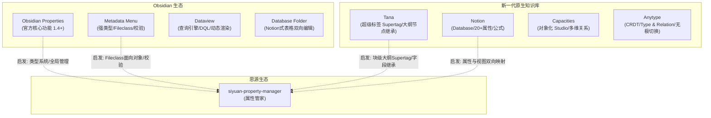
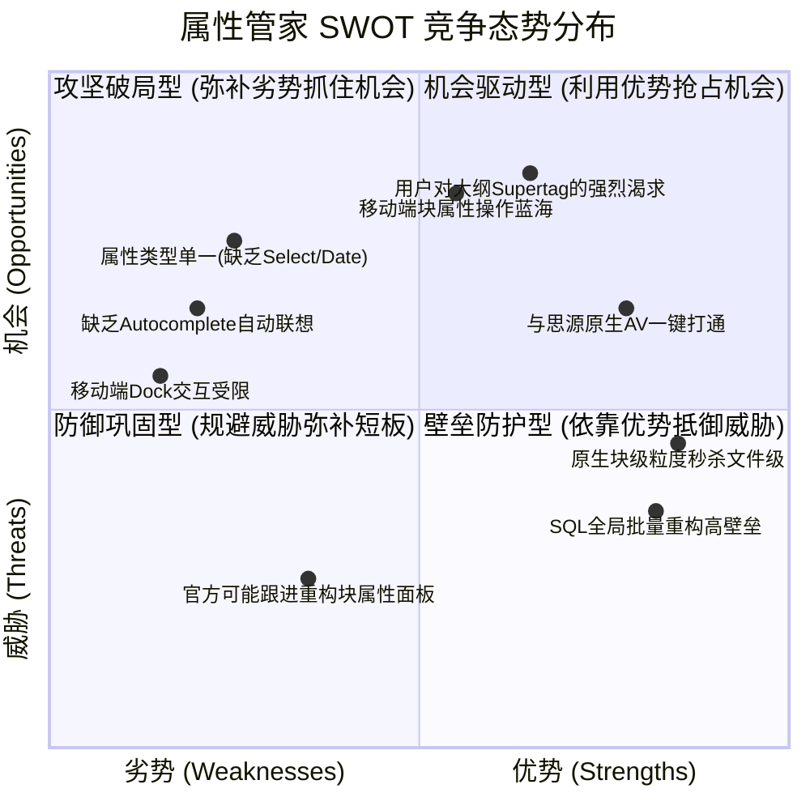
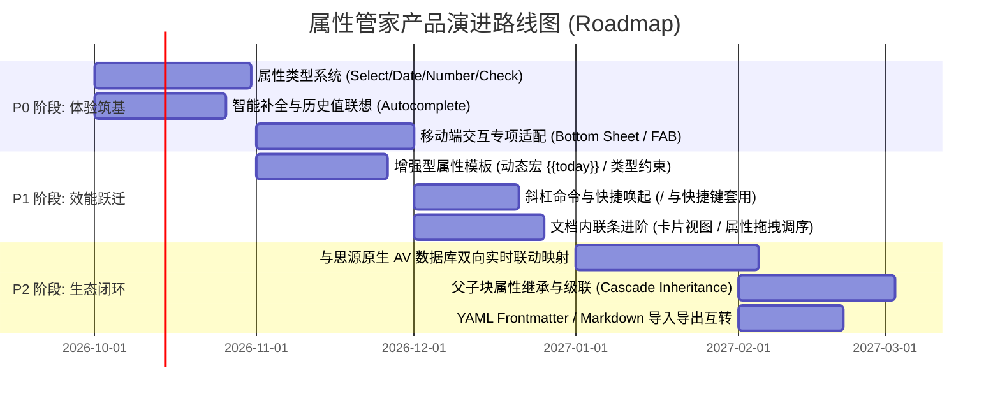
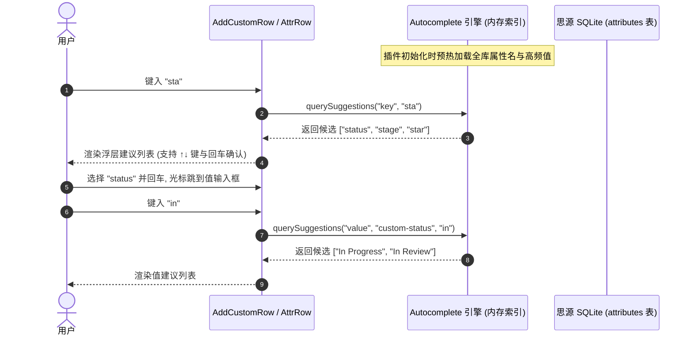

# 属性管家 (siyuan-property-manager) 竞品调研与产品竞争力分析报告

> **文档状态**：正式归档  
> **报告版本**：v1.0  
> **分析对象**：思源笔记插件 · 属性管家 (siyuan-property-manager)  
> **对比范围**：Obsidian 官方与第三方元数据生态、类 Notion/Capacities/Tana 原生应用  

---

## 目录

1. [执行摘要与项目现状](#1-执行摘要与项目现状)
2. [目标用户画像与核心场景剖析](#2-目标用户画像与核心场景剖析)
3. [行业标杆深度调研](#3-行业标杆深度调研)
   - 3.1 [Obsidian 官方生态：Properties (Frontmatter)](#31-obsidian-官方生态properties-frontmatter)
   - 3.2 [Obsidian 社区第三方标杆插件](#32-obsidian-社区第三方标杆插件)
   - 3.3 [新一代原生笔记与知识库应用](#33-新一代原生笔记与知识库应用)
4. [横向功能矩阵与项目进展对比](#4-横向功能矩阵与项目进展对比)
5. [SWOT 竞争态势分析](#5-swot-竞争态势分析)
6. [后续产品演进建议与路线图 (Roadmap)](#6-后续产品演进建议与路线图-roadmap)
   - 6.1 [P0 阶段：类型化基建与交互补齐（体验筑基）](#61-p0-阶段类型化基建与交互补齐体验筑基)
   - 6.2 [P1 阶段：模板进化与大纲语义增强（效能跃迁，类 Supertag）](#62-p1-阶段模板进化与大纲语义增强效能跃迁类-supertag)
   - 6.3 [P2 阶段：双向数据库联动与开放互联（生态闭环）](#63-p2-阶段双向数据库联动与开放互联生态闭环)
7. [核心新增特性技术与交互设计方案](#7-核心新增特性技术与交互设计方案)

---

## 1. 执行摘要与项目现状

### 1.1 项目使命与当前定位
思源笔记（SiYuan Note）以“一切皆块（Block-level）”和大纲树结构为核心，拥有深厚的 SQLite 本地关系型存储引擎与原生属性视图（Attribute View / 数据库）。然而，在原生交互中，块属性（Block Attributes）存在“入口深、输入慢、感知弱、难复用、重构成本高”的断层痛点。

**「属性管家 (siyuan-property-manager)」** 插件的定位是：**专为思源笔记打造的块属性全生命周期管理与数据化增强中枢**。它通过右侧栏 Dock 面板与文档内联条（Doc Inline Bar），打通了从“原子级属性实时录入”到“模板沉淀”、“全局统计运维”再到“原生数据库（AV）自动化建库”的完整链路。


### 1.2 当前项目开发进展盘点 (v0.3.x ~ v0.4.x)
- **底层架构**：基于 Vue 3 + TypeScript + Vite 架构，采用单例响应式监听思源 WebSocket (`ws-main` 事务防抖) 与 Protyle 光标焦点事件，支持属性变更跨组件实例同步与写操作串行队列 (`chainWrite`)。
- **已实现的核心能力**：
  1. **实时属性感知与就地编辑**：区分系统只读属性（`id`, `updated`, `type` 等）与用户自定义属性（`custom-*`），支持点击就地转输入框、失焦即时保存、乐观更新与网络回滚。
  2. **文档顶部内联面板 (Doc Inline Bar)**：利用 MutationObserver 挂载于正文与标题之间，自适应文档边距，支持折叠与状态记忆。
  3. **属性模板系统 (Templates)**：从当前块属性一键提取为模板，支持模板自定义管理、属性调序与一键向目标块填充。
  4. **文档与笔记本双层统计**：
     - 文档级自定义属性块列表与快捷定位高亮；
     - 笔记本级全量自定义属性分布统计（值数量、块数量、多维排序）。
  5. **全局批量重构与运维引擎**：单值穿透检索、行内快速改值、多选属性值批量重命名（全局替换）与批量安全删除。
  6. **基于模板的原生数据库 (AV) 一键建库**：通过 SQL 筛选全笔记本或当前文档内符合模板属性全集的块，自动构建 spec 4 标准的思源属性视图 JSON、插入块、绑定行记录并批量回填已有属性值。
  7. **笔记本数据库资产盘点**：统计全笔记本的 Attribute View 资产，提供行数、关联块数及跳转。

---

## 2. 目标用户画像与核心场景剖析

### 2.1 目标用户画像
1. **学术研究与重度文献学者**：
   - 特征：阅读海量论文、文献与专著，需要为每个文献摘录块或段落标记 `author`、`year`、`doi`、`journal`、`core_concept`、`rating` 等字段。
   - 诉求：不想为每个小摘录大动干戈创建庞大数据库，希望随写随打标，后期又可按字段过滤和汇总。
2. **知识管理极客与卡片盒（Zettelkasten）践行者**：
   - 特征：奉行原子化笔记，需要记录 `source`、`status`、`relation`、`topic` 等元数据。
   - 诉求：追求极低输入摩擦力，要求模板化输入、智能补全，拒绝手动输入重复的键名。
3. **任务与项目管理者（GTD / PARA）**：
   - 特征：在文档内嵌入任务块或项目里程碑，标记 `priority`、`due_date`、`assignee`、`progress`。
   - 诉求：需要对特定状态属性进行批量维护（如将“待处理”全部迁移为“已归档”），以及随时按项目维度一键聚合为表格看板。
4. **多端流动工作者（PC + 移动端 / 平板）**：
   - 特征：在电脑端整理架构，在手机/平板端快速捕获和微调笔记。
   - 诉求：移动端屏幕狭窄，原生弹窗交互极其繁琐，渴望有一键触达的快速属性抽屉或内联工具条。

### 2.2 核心痛点与场景旅程

| 场景阶段 | 用户行为 | 原生思源体验痛点 | 属性管家当前解决度 | 潜在体验差距 |
| :--- | :--- | :--- | :--- | :--- |
| **1. 记录与捕获** | 光标停在某个段落，想要记录状态或标签 | 需右键点击块图标 -> 查找“块属性” -> 弹窗输入，耗时 5~10 秒 | **优**：侧栏 Dock 光标跟随，点击即改，1 秒完成 | 属性值无法下拉选择预设枚举，全靠手工键盘输入 |
| **2. 标准化打标** | 为同类卡片连续添加统一属性结构 | 需重复手工键入相同的键名，拼写极易产生误差（如 `status` vs `state`） | **良**：模板库一键套用，统一键名与默认值 | 缺乏快捷指令（如 `/` 或快捷键唤起模板），不能继承父级上下文 |
| **3. 属性维护** | 调整分类体系，需合并或修正错别字属性值 | 无法全局检索属性值，需使用复杂 SQL 手动编写 update 语句 | **优**：笔记本统计透视，勾选批量重命名，一键全局替换 | 缺少单选值配置中心与属性键名全局改名（仅支持改值） |
| **4. 结构化汇总** | 将积累了同类属性的零散段落升格为表格视图 | 手动创建数据库 -> 手动逐列配置 -> 手动搜索并逐行关联关联块 | **极优**：按模板一键筛选块，自动建库并回填数据 | 建库后属于单向断点，修改块属性无法反向自动同步已建数据库对应列 |
| **5. 移动端查阅** | 手机端快速修改当前卡片的优先级或进度 | 移动端右键交互困难，块属性弹窗遮挡正文大半面积 | **中**：内联条可用，但 Dock 难以常驻，缺乏移动端专属抽屉 | 尚未针对移动端设计底部滑出面板（Bottom Sheet） |

---

## 3. 行业标杆深度调研

为确定产品的差异化竞争力与演进方向，我们深入调研了三类标杆：**Obsidian 官方生态**、**Obsidian 社区第三方头部插件**、以及**新一代原生知识库与对象管理软件**。



### 3.1 Obsidian 官方生态：Properties (Frontmatter)

在 Obsidian 1.4+ 中，官方彻底重构了 YAML Frontmatter，推出了图形化 Properties 机制。

- **核心机制**：
  - 基于文件头部的标准 YAML 数据流，保证纯文本 Markdown 兼容性。
  - 提供 **文件属性面板**（置于笔记顶部或侧边栏）与 **全局属性面板（All Properties）**。
- **属性类型系统**：
  - 支持 6 种标准数据类型：`Text`（文本）、`List`（多值列表/标签）、`Number`（数字）、`Checkbox`（布尔勾选）、`Date`（日期选择器）、`Time`（时间）。
  - 支持用户为属性键（Key）显式指定类型，同一库中同名键全局共享类型。
- **全库运维能力**：
  - 侧边栏 All Properties 列出全库所有属性名及其使用次数。
  - 支持 **全局属性改名（Rename）** 与 **全库属性类型切换**（自动转换对应 YAML 格式）。
- **移动端交互设计**：
  - 手机端采用紧凑折叠卡片形式置于文档顶部；
  - 针对 List/Tag 类型采用胶囊气泡（Pill/Chip）设计，针对 Checkbox 和 Date 采用移动端原生拨盘或弹出选择器。
- **短板与局限**：
  - **管理粒度仅限文件级（File-level）**：无法针对正文中的特定段落、列表项或标题打属性。
  - **缺乏动态公式与模板高级联动**：不支持字段默认值宏计算、跨文档级联关系。

### 3.2 Obsidian 社区第三方标杆插件

#### A. Metadata Menu（元数据大管家——最强类型与控制流）
- **核心定位**：将 Obsidian 的 Frontmatter 升级为强类型的“面向对象数据库”。
- **精髓特性**：
  - **Fileclass（文件类）机制**：类似于面向对象中的 Class。用户可以定义 `Book` 类具有 `author(text)`、`status(select: 读完,在读)`、`rating(number)`。笔记只要加入 `fileclass: Book`，即可自动继承这一整套字段定义。
  - **极度丰富的字段类型**：支持 `Select`（单选）、`Multi`（多选）、`Cycle`（点击循环切换状态）、`Boolean`、`Date`、`Lookup`（基于双链的字段查找）、`Formula`（轻量公式）。
  - **全场景极速录入**：
    - 在正文内直接点击内联属性标签（Inline Field）弹出快速选择菜单；
    - 右键文件即可快速呼出属性编辑模态框；
    - 内置类似 Notion 的 Table View，支持直接在表格内单元格改值并反写文件。
  - **严格校验**：支持为属性设置合法值范围，输入错误给出校验提示。

#### B. Dataview（查询事实标准与极客生态）
- **核心定位**：把整个 Markdown 库当成数据库，提供类 SQL 的 DQL 查询语言。
- **与属性的关系**：用户通过 Frontmatter 或内联 `[key:: value]` 语法打标，通过 `TABLE status, author FROM #reading` 动态生成只读表格。
- **启示**：Dataview 培养了用户“元数据结构化”的习惯，但它缺乏**轻量可视化的录入与批量重构面板**（这正是属性管家的强项）。

#### C. Database Folder & Projects（双向多维表格）
- **核心机制**：监听文件夹或属性过滤，将笔记集合渲染为多维表格、看板或画廊；在表格中修改字段，直接实时写回文件的 Frontmatter。

#### D. Tag Wrangler（标签运维典范）
- **核心定位**：弥补 Obsidian 原生标签无法批量重命名的短板。支持在标签树中右键重命名、拆分、合并标签，自动扫描并批量替换全库。

### 3.3 新一代原生笔记与知识库应用

| 软件 | 核心元数据模型 | 属性管理交互形态 | 移动端交互亮点 | 对思源属性管家的启示 |
| :--- | :--- | :--- | :--- | :--- |
| **Notion** | **Page-level Database Properties**<br>依托云端集中式 Schema，支持 20+ 种属性类型（Formula, Rollup, Relation, Status 等） | 页面顶部紧凑表格属性区，可按需“始终显示/折叠/隐藏”；点击单元格弹出专用控件 | 移动端自适应极佳，底部滑出 Popover 选单，横滑标签 | 属性类型控件（Select、Date、Status）的视觉规范与折叠体验直接借鉴标准 |
| **Tana** | **Supertag（超级标签）**<br>世界首创大纲级面向对象系统。每个大纲节点可打 `#tag`，立即挂载字段表 | 极其丝滑：输入 `#` 选择标签，下方自动展开缩进字段；字段值支持反向搜索其他节点 | 极简移动端捕获，预置 Supertag 快捷入口 | **与思源最契合的模型**：思源是纯块级大纲，属性管家未来可演进为“思源版 Supertag” |
| **Capacities** | **Object Studio（对象工作室）**<br>以实体对象为中心，笔记不是自由页面，而是具体实体（Book, Person, Task） | 统一在 Object Studio 配置字段；每个实体顶部固定展示其对象的强类型属性面板 | 底部快捷操作栏（Quick Add），快速捕获特定对象类型属性 | 模板不应仅仅是散装 key-value，应升格为“块对象定义（Block Schema）” |
| **Anytype** | **Types & Relations**<br>基于本地优先 CRDT，自由组合 Relation，支持视图自由切换 | 属性即 Relation，不仅用于当前页，而且可在画廊、表格、看板等任意视图中作为分组、过滤条件 | 触控友好，卡片式展示与大点击区域 | 强调本地优先与隐私安全，属性应能无缝转换为多维视图过滤元数据 |
| **Heptabase** | **Card Properties & Whiteboard**<br>卡片盒属性系统，专为白板视觉化设计 | 卡片右上角展开属性面板；支持在白板中根据属性快速着色、连线与分类 | 平板/触控端手势支持友好 | 属性在视觉层面的状态区分（如通过颜色 Tag 展现不同状态） |

---

## 4. 横向功能矩阵与项目进展对比

将 **属性管家 (siyuan-property-manager)** 与上述核心竞品进行全景能力对标：

| 评估维度 | 思源属性管家 (当前状态) | Obsidian Properties (官方) | Metadata Menu (Obsidian) | Tana (Supertag) | Notion (Database) |
| :--- | :--- | :--- | :--- | :--- | :--- |
| **管理粒度** | **任意块 (Block) + 文档**<br>（标题/段落/列表/引述） | 仅文档级 (Frontmatter) | 仅文档级 (Frontmatter/Inline) | **任意节点 (Node/Block)** | 仅限页面级 (Page) |
| **属性类型系统** | 仅纯文本 (Text/Textarea) | 6 种基础类型 (Text/List/Num/Date/Time/Check) | **极丰富** (Select/Multi/Cycle/Date/Lookup/Formula) | 强类型 (Field/Date/Number/Ref/Instance) | **极其丰富** (20+ 种, 含 Rollup/Formula/Relation) |
| **就地编辑响应** | **极高**（毫秒级光标跟随，乐观更新） | 高（顶部直接点击） | 高（模态框或行内点击） | **极高**（大纲原生嵌入） | 高（单元格弹出） |
| **模板/Schema体系** | 轻量 KV 预设，支持快速套用 | 无原生 Schema（需借助模板插件） | **强大**（Fileclass 架构，支持继承与校验） | **顶级**（Supertag 继承与多重标签） | 页面模板 (Template Page) |
| **智能输入与联想** | 暂无（需手动键入全部字符） | 键名/Tags 自动补全 | 强类型下拉、自动校验 | 极速检索节点与历史值 | 下拉列表、自适应搜索 |
| **全局统计与运维** | **极其强大**<br>（全库透视、多维排序、批量改值/删值） | 良好（All Properties 改名与类型转换） | 良好（表格统一维护） | 依赖查询大纲手动调整 | 视图过滤批量编辑 |
| **底层数据库打通** | **独创一键建库**<br>（自动生成原生 AV，回填数据） | 无原生数据库（依赖 Dataview） | 需依赖第三方表格插件 | 原生结合大纲搜索 | 原生即数据库 |
| **移动端专属适配** | 基础适配（依赖思源 Dock 与内联条） | **优秀**（自适应抽屉与原生控件） | 一般（依赖模态框） | **优秀**（专门的移动捕获应用） | **极优**（原生触控与底部滑层） |
| **本地优先与安全性** | **100% 本地纯离线**，直写原生属性 | 100% 本地纯文本 | 100% 本地纯文本 | 云端闭源 | 云端闭源 |

---

## 5. SWOT 竞争态势分析



### 5.1 核心优势（Strengths）
1. **原子级粒度壁垒（Block-Level Granularity）**：
   相较于 Obsidian 无论官方 Properties 还是 Metadata Menu 均局限于 Markdown 文件级（File-level），属性管家依托思源底层的块结构，能够毫秒级为**任意段落、标题、列表项、代码块**打标。这种细粒度是实现真正卡片盒与大纲工作流的前提。
2. **底层 SQLite 驱动的高性能统计与批量重构**：
   内置精准高效的 SQL 查询引擎，支持全笔记本自定义属性分布全景盘点、穿透式块定位高亮、多选批量重命名与批量清理。重构数万字的知识库属性仅需数十毫秒，远超文本正则遍历插件。
3. **首创“属性模板 → 原生属性视图 (AV)”自动建库桥梁**：
   解决了从“零散非结构化打标”向“结构化表格”演进的断层。一键建库、自动声明列、自动绑定行并批量回填属性，是整个思源生态中目前独一无二的杀手级功能。
4. **极致性能与无感交互**：
   采用 optimistic update（乐观更新）+ 串行写队列 + WebSocket 事务防抖，输入体验如同原生编辑器一样丝滑无延迟，不卡顿、不破坏写作心流。

### 5.2 核心劣势（Weaknesses）
1. **缺乏结构化属性类型系统（Type System）**：
   当前所有属性均降水为纯字符串（Text/Textarea），缺少知识管理中最常用的 `Select`（单选/状态）、`Tags`（多选标签）、`Date`（日期选择）、`Number`（数字校验）、`Checkbox`（布尔值）和 `Relation`（块引用双链），用户仍需手动敲入一切。
2. **缺乏智能补全与联想机制（Autocomplete & Suggestion）**：
   在添加新属性时，无法联想历史上已使用过的属性名；在输入属性值时，无法下拉选择历史值或同类模板候选值，导致拼写一致性仍需用户肉眼保证。
3. **移动端交互形态尚未深度优化**：
   思源移动端（iOS / Android / 平板）没有常驻右侧 Dock 栏，用户在移动端使用本插件体验大打折扣，缺少移动端原生的底部滑出抽屉（Bottom Sheet）或悬浮操作球（FAB）。
4. **单向建库断层，缺少双向动态同步**：
   当前通过模板一键生成 AV 数据库后，两者的联系即告终止。若用户后续在侧栏修改了块属性，已建数据库中的列值不会自动联动；反之在数据库中修改单元格，块属性也未做双向映射。

### 5.3 市场机会（Opportunities）
1. **思源生态内“大纲 Supertag”的心智真空**：
   大量从 Tana、Logseq、Roam Research 迁移至思源的用户，对块级字段与标签继承有极其强烈的需求。属性管家天然具备块级优势，极有希望成为思源生态的“Tana Supertag 替代者”。
2. **移动端元数据轻量录入的蓝海**：
   思源官方移动端查看和修改块属性需经过多层点击，操作成本极高。若属性管家能推出自适应移动端的高效属性悬浮条或底栏抽屉，将迅速占领移动端用户的刚需心智。
3. **知识库标准化规范与数据治理刚需**：
   随着用户知识库运行 2~3 年以上，混乱无序的自定义属性成为普遍痛点。属性管家完善的运维和统计能力，具备成为知识库“数据清洗与质量体检工具”的潜力。

### 5.4 潜在威胁（Threats）
1. **思源官方内核迭代的吸收与替代**：
   若思源官方在未来版本重构块属性面板或在 Protyle 中直接原生内置内联属性条，本插件的基础展示功能可能被分流。插件必须向“高级类型系统”、“模板自动化”、“批量治理”等高阶护城河功能演进。
2. **第三方数据库或多维表格插件的功能侵蚀**：
   部分社区表格插件可能逐渐下沉，加入块属性打标功能。

---

## 6. 后续产品演进建议与路线图 (Roadmap)

基于上述调研与 SWOT 分析，属性管家应坚持**“以块级粒度为基石，以类型化与智能输入为抓手，以大纲语义增强与双向数据库为护城河”**的演进战略。



---

### 6.1 P0 阶段：类型化基建与交互补齐（体验筑基）
> **目标**：彻底告别纯文本录入时代，让属性录入兼备规范性与极致效率；实现移动端完全可用。

#### 1. 结构化属性类型系统（Attribute Types）
为用户自定义属性提供显式或智能推导的数据类型支持，不同类型渲染专属的编辑控件：
- **`text`（单行/多行文本）**：保留现有交互，长文本自动展开为 Textarea。
- **`select`（单选枚举）**：以标签（Pill）形式呈现，支持配置选项列表与颜色；点击展开下拉选择器，支持键盘方向键快速选择。
- **`multi-select`（多选标签）**：支持一个属性中存放多个 Tag（底层通过逗号或分隔符持久化），提供胶囊式 Tag 增删。
- **`date` / `datetime`（日期时间）**：点击弹出思源原生日期选择器或轻量日历组件，支持快速输入快捷词（如“今天”、“明天”、“+3d”）。
- **`number`（数字）**：限制数字输入，支持格式化（货币、百分比、纯数字）。
- **`checkbox`（布尔开关）**：渲染为开关 Toggle 或 Checkbox，一键切换 `true` / `false`。
- **`block-ref`（块关联）**：支持搜索并绑定思源内其他块 ID，点击可直接跳转，实现轻量级关系（Relation）。

#### 2. 智能联想与自动补全（Autocomplete & Suggestion）
- **属性名补全**：在新增属性（`AddCustomRow`）输入框中键入时，根据全库历史已用过的 `custom-*` 属性列表即时弹出补全菜单。
- **属性值联想**：在编辑某属性值时，自动根据该属性在笔记本中出现过的所有候选值按频次排序展示下拉推荐，支持模糊拼音匹配，避免重复发明同义词。

#### 3. 移动端与平板端专项适配（Mobile First Adaptation）
- **移动端底部抽屉（Bottom Sheet）**：当检测到移动端环境（`isMobile === true`）时，不依赖窄屏 Dock，改为通过编辑器顶部悬浮工具条或底部操作栏一键呼出 Bottom Sheet 抽屉，半屏/全屏平滑展开。
- **大触控区域与手势支持**：放大行距与点击目标，支持左滑删除属性、右滑快速复制，针对虚拟键盘弹出自动调整滚动避让。

---

### 6.2 P1 阶段：模板进化与大纲语义增强（效能跃迁，类 Supertag）
> **目标**：将轻量模板升级为类似 Tana Supertag 的“块级实体 Schema”，深度融入沉浸式写作流。

#### 1. 增强型属性模板（Enhanced Templates）
- **类型化模板配置**：在定义模板时，不仅预设默认值，还能指定每个字段的数据类型（如：`rating: number`, `status: select`, `date: date`）。
- **动态宏变量（Dynamic Template Macros）**：默认值支持动态计算宏，在套用时自动求值：
  - `{{today}}`、`{{now}}`：自动填充当前日期与时间；
  - `{{title}}`：自动提取当前文档标题；
  - `{{parent}}`：自动提取父级块文本；
  - `{{random_id}}`：生成唯一流水号。

#### 2. 沉浸式快捷调用流（Slash Command & Shortcuts）
- **斜杠命令一键注入**：在编辑器中输入 `/` 触发命令菜单，提供 `/套用属性模板` 选项，键盘敲回车直接为当前块打上全套属性。
- **自定义全局快捷键**：支持为高频使用的模板绑定独立快捷键（如 `Alt + 1` 为当前块打上 `#todo` 模板属性）。

#### 3. 文档内联面板（Doc Inline Bar）高阶进化
- **卡片/条状多模式切换**：提供“紧凑单行条”、“自适应卡片网格”与“表格折叠”三种显示形态。
- **属性拖拽排序**：支持通过抓手图标自由拖拽调整文档顶部属性的展示次序，并记忆保存。
- **内联快捷套用模板**：在内联条右侧提供“模板”快捷下拉，一键为整篇文档填充元数据结构。

---

### 6.3 P2 阶段：双向数据库联动与开放互联（生态闭环）
> **目标**：打通与思源原生属性视图（AV）的双向实时管道，实现知识库层级语义扩散与跨平台兼容。

#### 1. 与思源原生属性视图（AV）的双向实时映射
- **当前瓶颈**：目前通过模板生成的 AV 属于“快照导出”，后续修改割裂。
- **演进目标**：
  - 建立“模板 ↔ 属性视图 ↔ 块属性”的绑定元数据映射；
  - 当在属性管家面板修改某个块的自定义属性时，若该块已被关联在某 AV 数据库中，通过后台异步触发 `batchSetAttributeViewBlockAttrs` 自动更新对应单元格；
  - 反之，监听 AV 的更新事件，反写更新块属性，彻底解决“块属性”与“数据库列”二元割裂的问题。

#### 2. 父子块属性继承与级联（Cascade Inheritance）
- **大纲级属性继承机制**：在思源树形大纲中，允许子块选择性继承父块或文档块的属性（例如：项目大纲块标记了 `project=AI-Research`，其下所有子任务块在面板中自动显示置灰的继承属性 `(inherit) project=AI-Research`）。
- **覆盖与具象化**：子块一旦单独修改该属性，则转化为显式重写，提供与编程语言面向对象一致的大纲语义体验。

#### 3. 跨平台兼容与导入导出（Interoperability）
- **Markdown YAML Frontmatter 双向转换**：支持将当前文档的 `custom-*` 属性一键导出为标准的 YAML Frontmatter，或从外部 Markdown 导入 YAML 自动写入思源块属性。
- **Obsidian / Notion 兼容模式**：提供属性映射字典，让从 Obsidian（Properties）迁移过来的笔记保持元数据无损。

---

## 7. 核心新增特性技术与交互设计方案

为了确保上述路线图具备直接的工程落地可行性，针对 **P0 阶段的 3 项关键特性** 给出具体的技术架构与交互设计方案。

### 7.1 属性类型系统（Type System）设计方案

#### 数据存储向下兼容原则
由于思源笔记底层的 `attributes` 表仅存储 `name (VARCHAR)` 与 `value (TEXT)`，本插件的类型系统必须保持**纯原生存储兼容**，不改动思源底层 Schema。

- **类型元数据定义（Schema Registry）**：
  在插件配置存储 `types-schema.json` 中维护全局属性名与其类型定义：
  ```typescript
  export type AttrType = 'text' | 'select' | 'multi-select' | 'date' | 'number' | 'checkbox' | 'block-ref'

  export interface AttrOption {
    label: string
    value: string
    color?: string
  }

  export interface AttrSchemaItem {
    name: string                // 例如 "custom-status"
    type: AttrType
    options?: AttrOption[]      // 供 select / multi-select 使用
    numberFormat?: string       // 供 number 格式化
    dateFormat?: string         // 供 date 格式化
  }
  ```
- **自动类型推导（Type Inference）**：
  若用户未显式为某属性指定类型，插件根据现有值的特征进行启发式推导（如匹配 ISO 日期格式则推导为 `date`，值为 `true/false` 推导为 `checkbox`，含逗号推导为 `multi-select`，其余默认 `text`）。
- **组件解耦架构**：
  将原本单一的 `AttrRow.vue` 重构为分发器（Dispatcher），按类型挂载专用编辑器组件：
  - `AttrTypeText.vue`
  - `AttrTypeSelect.vue`（集成轻量下拉与颜色 Tag）
  - `AttrTypeDate.vue`（集成原生日期选择弹窗）
  - `AttrTypeCheckbox.vue`
  - `AttrTypeBlockRef.vue`（调用思源 `searchBlock` API 快速选择目标块）

### 7.2 智能补全与联想机制（Autocomplete Engine）



- **实现机制**：
  1. 插件启动及定期在后台通过 SQL 汇总不重复的属性名及其高频取值（Top 500），在内存中维护轻量 Trie 树或倒排索引。
  2. 针对中文用户，支持基于拼音首字母模糊匹配（如输入 `jxz` 自动联想出 `进行中`）。
  3. 提供无感键盘导航：`Tab` / `Enter` 快速采纳，`Esc` 退出。

### 7.3 移动端专项适配（Mobile Sheet & Touch Architecture）

- **DOM 挂载策略调整**：
  - 桌面端：依然挂载在思源右侧 Dock；
  - 移动端：由于手机屏幕没有常驻 Dock，插件检测 `this.isMobile` 为真时：
    1. 在思源移动端顶栏右侧或底部快捷栏注册一个专用图标按钮；
    2. 点击图标时，触发挂载在 `document.body` 顶层的 **移动端专用抽屉（Mobile Bottom Sheet）**；
    3. 支持手势向下滑动收起抽屉。
- **内联条移动端自适应**：
  - 移动端默认折叠内联条，只以一行极简徽标（如 `📌 3 属性`）形式呈现，点击后在下方平滑展开为触控卡片。

---

## 8. 总结与行动建议

通过本报告的系统调研与对比分析可以得出明确结论：

1. **核心壁垒坚固**：`siyuan-property-manager` 在**块级管理粒度**、**全库 SQL 批量治理运维**以及**一键转换为思源原生数据库（AV）**等核心能力上，不仅在思源生态中处于绝对领先地位，而且在管理细粒度与重构效能上超越了 Obsidian 原生 Properties。
2. **决胜点在于“体验跃迁”**：当前插件最关键的制约因素是“全文本型录入的笨拙感”与“移动端的缺位”。一旦补齐 **P0 阶段的属性类型系统（Select/Date/Checkbox）、自动联想推荐** 以及 **移动端专属抽屉交互**，产品的易用性和用户粘性将迎来爆发式增长。
3. **长期愿景——思源超级标签（Supertag）中枢**：依托思源的原生块架构，插件中远期若能完成类 Tana 的模板继承、快捷指令生态与双向数据库实时联动，将有望从单一的“辅助工具”进化为思源笔记生态中至关重要的“结构化知识中枢”。

建议研发团队紧扣 **P0 路线图**，优先启动 **属性类型系统与自动补全** 的重构开发，奠定下一代属性管理的坚实基石。
